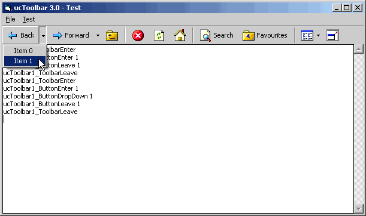

## API\-ucToolbar 3\.1

### Description

ucToolbar version 3.1 (API). // Update 10/17: AddBitmap() and AddIcon() methods. // Fixed shutdown-crash when using manifest for themes (thanks to Abhishek.NET for report this). Also fixed ToolbarEnter() and ButtonEnter() events when button disabled.
 
### More Info
 

             |
---                |---
**Submitted On**   |2004-10-18 15:49:22
**By**             |[Carles P\.V\.](https://github.com/Planet-Source-Code/PSCIndex/blob/master/ByAuthor/carles-p-v.md)
**Level**          |Intermediate
**User Rating**    |5.0 (95 globes from 19 users)
**Compatibility**  |VB 6\.0
**Category**       |[Custom Controls/ Forms/  Menus](https://github.com/Planet-Source-Code/PSCIndex/blob/master/ByCategory/custom-controls-forms-menus__1-4.md)
**World**          |[Visual Basic](https://github.com/Planet-Source-Code/PSCIndex/blob/master/ByWorld/visual-basic.md)
**Archive File**   |[API\-ucTool1887975132005\.zip](https://github.com/Planet-Source-Code/carles-p-v-api-uctoolbar-3-1__1-56769/archive/master.zip)

